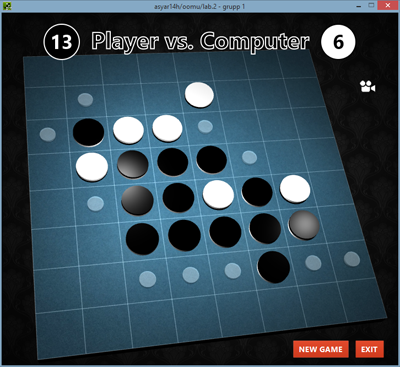

# Objektorienterad mjukvaruutveckling
##Laboration 2: Grafik, Händelser & Trådar
###Syfte
Laborationen behandlar skapandet av grafiska gränssnitt, händelsehantering, trådar
och objektorientering.
###Uppgift
Laborationen går ut på att konstruera ett objektorienterat Java-program som spelar
”Othello”. Programmet skall fungera på två
olika sätt: antingen skall en ensam spelare kunna spela mot datorn eller så skall två
spelare kunna spela mot varandra.

Decided to develop a 3D game interface for fun!

